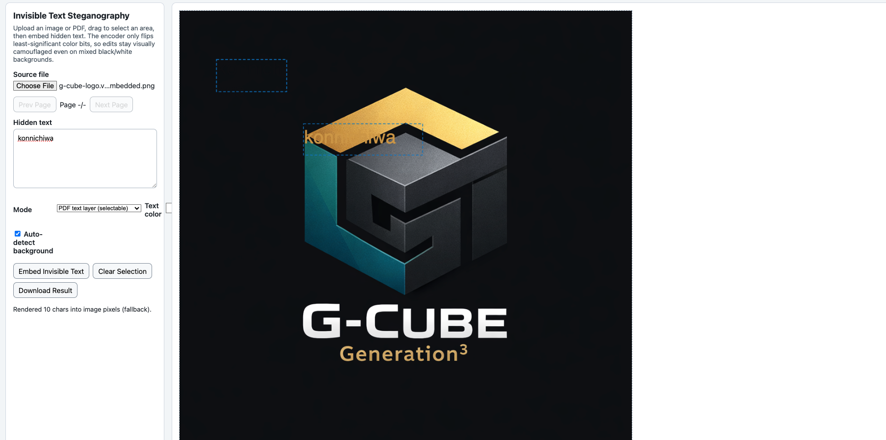

# invisible_text

Local-first tool for creating "invisible" plaintext inside images and PDFs by matching the text color to the background or embedding as a PDF text layer.
The app supports three modes: `text-layer` (preferred for PDFs — adds selectable native PDF text), `image-ocr` (renders text pixels with background-matched color for OCR extraction), and `lsb` (per-pixel LSB steganography).

## Motivation
I thought of building this out to test AI-backed resume screeners. Imagine this, an LLM is scraping my resumed for text and falls victim to prompt injection (which is hidden in plain sight but invisible to the naked eye).

Let's see how many interviews I get invited to ;)

## Current Project Layout

- `index.html` - App shell and UI
- `styles.css` - App styling
- `app.js` - Image/PDF rendering, area selection, invisible-text embedding, export

## Run Locally

1. Start a local static server from this directory:
   - `python3 -m http.server 4173`
2. Open `http://localhost:4173` in a browser.
   

## Usage

1. Upload an image or PDF.
2. Drag on the canvas to select a target area.
3. Enter text in **Hidden text**.
4. Click **Embed Invisible Text**.
5. Click **Download Result** to export PNG or PDF.

## Notes

- PDF rendering uses PDF.js loaded from CDN.
- PDF export uses jsPDF loaded from CDN.
- All processing happens in-browser on the local machine.

## Testing
A browser-based automated test runner is included at `test/test_pdf_text_layer.html`.
Open that file in a browser with internet access (so it can load CDN-hosted pdf.js and jsPDF). The page will run a self-check that creates a PDF, adds a text-layer annotation, exports a PDF, and validates the text is present in the exported PDF. The page reports PASS/FAIL in the UI.
